<div align="center">



[](https://git.io/typing-svg)


</div>

---

## 👋 Who I Am

```ts
const abdulGani = {
  title: "Fullstack AI Automation Developer",
  location: "Davangere, Karnataka, India",
  stack: {
    frontend: ["JavaScript", "HTML5", "CSS3", "HTML5 Canvas", "MediaPipe", "Web Audio API"],
    backend: ["Python", "Streamlit", "SQLite", "RTSP Stream Handling", "API Integration"],
    aiMl: ["YOLOv8", "ByteTrack", "OpenCV", "Deep Learning", "Computer Vision", "Object Detection", "Real-Time Inference"],
    tools: ["Git", "GitHub", "VS Code", "Web API Automation"],
  },
  launchedProjects: [
    "Tactical Crowd Sentinel — real-time crowd anomaly detection",
    "ParkVision — AI-powered aerial parking management",
    "Hand Tracking Aura FX — gesture-controlled AR engine",
  ],
  certifications: [
    "OCI 2025 Certified Generative AI Professional — Oracle University (Oct 2025)",
    "Get Started with Generative AI in Azure — Microsoft Learn (Nov 2025)",
    "AWS ML Engineer Associate & Advanced AWS DevOps Testing — AWS (Oct–Nov 2025)",
  ],
  status: "Final Year BCA student @ Davanagere University — Expected 2027",
  openTo: "Fullstack AI Automation Developer roles",
} as const;
```

---

## 🚀 Featured Projects

### 🛰️ Tactical Crowd Sentinel
Computer vision pipeline for crowd anomaly detection — real-time YOLOv8 + ByteTrack multi-object tracking, a multi-level threat-scoring model, and a Streamlit dashboard with live heatmaps and SQLite-backed event logging.

[](https://github.com/abdulgani231sz/tactical-crowd-sentinel)

| Layer | Technology |
|---|---|
| Detection | YOLOv8 |
| Tracking | ByteTrack |
| Vision | OpenCV |
| Language | Python |
| Dashboard | Streamlit |
| Storage | SQLite |

🔗 **Code:** [github.com/abdulgani231sz/tactical-crowd-sentinel](https://github.com/abdulgani231sz/tactical-crowd-sentinel)

<br>

### 🅿️ ParkVision
AI-powered aerial parking management system — integrates YOLOv8 detection with ByteTrack to keep consistent vehicle identity across drone footage and live RTSP streams, logging vacancy/occupancy state to SQLite for analytics.

[](https://github.com/abdulgani231sz/Ai-ParkVision)

| Layer | Technology |
|---|---|
| Detection | YOLOv8 |
| Tracking | ByteTrack |
| Streaming | RTSP |
| Language | Python |
| Dashboard | Streamlit |
| Storage | SQLite |

🔗 **Code:** [github.com/abdulgani231sz/Ai-ParkVision](https://github.com/abdulgani231sz/Ai-ParkVision)

---

## 🛠️ Tech Stack

**Languages**


**Frontend**


**Backend & Infra**


**Cloud**


**AI / DB**


**Dev Tools**


---

## 📊 GitHub Stats

<div align="center">


</div>

<details>
<summary>Individual stat cards (backup view)</summary>

<div align="center">


</div>

</details>

## 🏆 Trophies

<div align="center">


</div>

## 🐍 Contribution Snake

<div align="center">


</div>

## 📈 Contribution Activity

<div align="center">


</div>

---

## 🔗 Connect

<div align="center">

[](https://linkedin.com/in/abdul-gani-08sz)
[](mailto:abdulgani231sz@gmail.com)
[](https://abdul-gani-portfolio.vercel.app/)
[](https://github.com/abdulgani231sz)

</div>

<div align="center">


</div>
